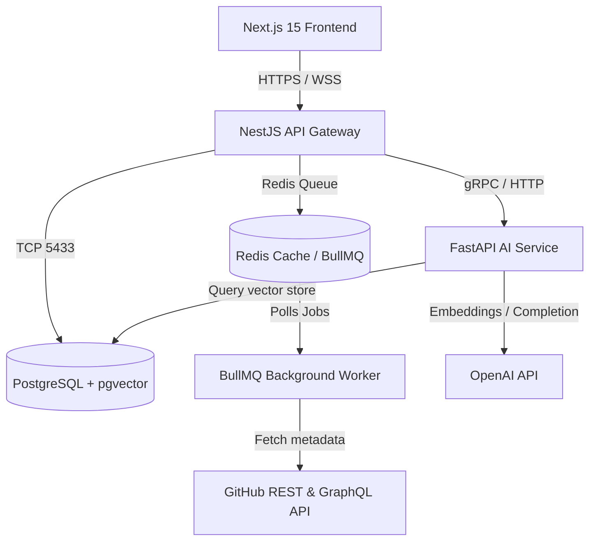

# DevOS — AI-Powered Engineering Operating System

DevOS is a multi-tenant, event-driven Engineering Operating System designed to replace fragmented tools (Jira, GitHub, Confluence, DORA calculators) with a unified, real-time dashboard. By connecting directly to GitHub REST/GraphQL APIs, webhook event streams, Redis, and LLMs, DevOS bridges the gap between codebase activity and team delivery.

---

## 1. System Architecture



---

## 2. Core Workflows & Engines

### A. Webhook Signature Verification & Idempotency
1. **HMAC Check**: GitHub dispatches events containing an `X-Hub-Signature-256` header (calculated using the repository's Webhook secret). DevOS reads the raw body stream buffer (`req.rawBody`) in the API gateway and verifies the hash signature using secure timing checks to block fraudulent events.
2. **Duplication Guard**: The `X-GitHub-Delivery` ID is checked against a Redis cache and the `WebhookEvent` table in PostgreSQL. If the delivery ID already exists, the event is immediately ignored with an HTTP 200 to prevent double-processing.
3. **Queue Dispatch**: Valid events are enqueued in Redis for BullMQ background workers to process, ensuring the API gateway remains unblocked and highly responsive.

### B. Background Synchronization Worker
- **Async Syncs**: When a user connects a repository, a `repo-import` job is submitted to BullMQ.
- **Data Gathering**: The worker pulls up to 100 commits, 50 pull requests, and 50 issues from the GitHub API (with automatic fallback to mock mock-ups if no API credentials are provided).
- **Prisma Transactions**: The synchronized entities are upserted into PostgreSQL databases.

### C. Multi-Tenant Organization & RBAC Guard
- **Data Isolation**: A strict multi-tenant database boundary is maintained. All project management entities (sprints, tasks, repositories) are filtered by `orgId`.
- **RBAC enforcement**: Decorator-based guards (`@Roles(Role.OWNER, Role.ADMIN)`) verify the authenticated user's organization-membership role before granting permission to perform actions (such as creating sprints, deleting tasks, or importing repositories).

### D. File Storage Strategy Pattern
- Consuming controllers upload attachments through a dynamic `StorageService` interface. Based on environment variables, the service resolves uploads to the local filesystem (`LocalStorageProvider` fallback) or streams files directly into Amazon S3 (`S3StorageProvider` driver).

---

## 3. Monorepo File Directory Map

```
Ai-platform/
 ├── docs/                         # Startup Engineering Bible specifications (10 parts)
 │    ├── 01_prd.md                # Vision & Personas
 │    ├── 02_feature_spec.md       # 17 Modules specification
 │    ├── 03_ui_ux_spec.md         # 52 Screens layout specs
 │    ├── 04_hld.md                # System Architecture & Event flows
 │    ├── 05_lld.md                # Design patterns & folder maps
 │    ├── 06_database_design.md    # 28 Table schema layouts
 │    ├── 07_api_contracts.md      # REST request/response schemas
 │    ├── 08_aws_infra.md          # ECS, RDS, S3 AWS blueprints
 │    ├── 09_testing_production.md # Test scopes and safety checklists
 │    └── 10_implementation_guide.md # Day 1–45 roadmap
 ├── backend/                      # NestJS API Gateway & Queue Worker Service
 │    ├── prisma/                  # Prisma Schemas & migrations
 │    ├── src/                     # NestJS modular components
 │    └── package.json             # Backend dependencies
 ├── frontend/                     # Next.js 15 App Router Web Client
 │    ├── src/app/                 # Client routes (login, dashboard)
 │    ├── src/store/               # Zustand session stores
 │    ├── src/lib/                 # Axios clients & interceptors
 │    └── package.json             # Frontend dependencies
 ├── ai-service/                   # FastAPI AI Platform Service
 │    ├── main.py                  # FastAPI server entry point
 │    └── requirements.txt         # AI packages
 ├── docker-compose.yml            # Exposes PostgreSQL (5433) and Redis (6379)
 └── README.md                     # This file
```

---

## 4. Local Quickstart Guide

### Prerequisites
- **Node.js**: v20.x or newer
- **Python**: v3.11 or newer
- **Docker**: Desktop running locally

### Step 1: Spin up Databases (Docker Compose)
In the root directory, launch the backing database and Redis containers:
```bash
docker compose up -d
```
*Note: PostgreSQL is mapped to host port `5433` (to avoid native PG clashes on 5432), and Redis is on port `6379`.*

### Step 2: Configure & Start NestJS Backend
1. Navigate to the backend directory:
   ```bash
   cd backend
   ```
2. Apply the database migrations:
   ```bash
   npx prisma migrate dev
   ```
3. Start the NestJS application server:
   ```bash
   npm run start:dev
   ```
*The backend API gateway is now running on `http://localhost:3001`.*

### Step 3: Configure & Start Next.js Frontend
1. In a new terminal window, navigate to the frontend directory:
   ```bash
   cd frontend
   ```
2. Start the Turbopack dev server:
   ```bash
   npm run dev
   ```
*The web dashboard is now accessible at `http://localhost:3000`. You can register a new account or sign in.*

### Step 4: Start FastAPI AI Service
1. Navigate to the AI service directory:
   ```bash
   cd ai-service
   ```
2. Create and source virtual environment:
   ```bash
   python3 -m venv .venv
   source .venv/bin/activate
   ```
3. Start the FastAPI server using Uvicorn:
   ```bash
   pip install -r requirements.txt
   uvicorn main:app --host 127.0.0.1 --port 8000 --reload
   ```
*The AI RAG and Review service is now listening on `http://localhost:8000`.*
