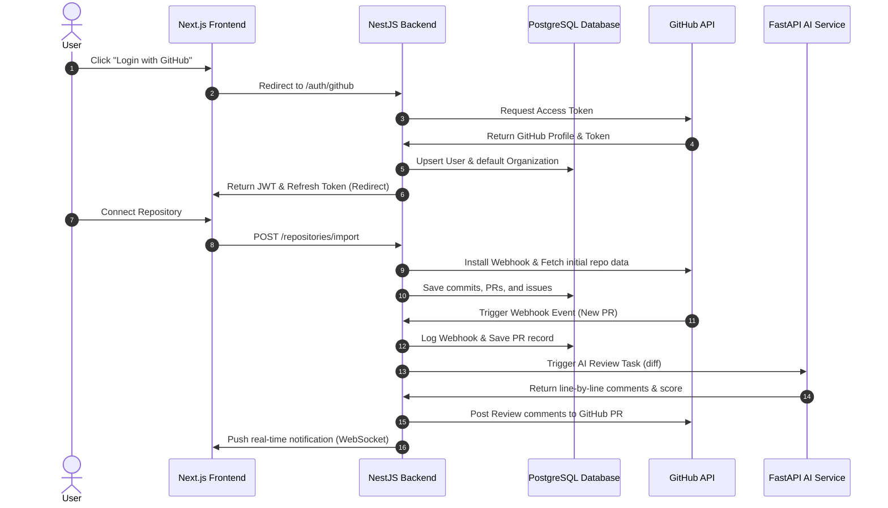

# DevOS — Product Requirements Document (PRD) v1.0

## 1. Vision & Value Proposition
DevOS is a next-generation, production-grade **AI Engineering Operating System** designed to replace fragmented tools (Jira, GitHub, Confluence, analytics tools, release trackers) with a single, event-driven SaaS platform. By integrating directly with GitHub webhooks, AWS S3, and LLMs, DevOS bridges the gap between codebase activity and sprint velocity.

### Primary Goal
Deliver a consolidated, event-driven dashboard that shows real-time contributor velocity, automated AI code reviews, sprint boards, and CI/CD monitoring, giving engineers and leadership a single source of truth.

---

## 2. Target User Personas

| Persona | Role | Primary Needs | Pain Points Solved |
| :--- | :--- | :--- | :--- |
| **Developer** | Full Stack Engineer | Code velocity, minimal tool context-switching, instant PR feedback. | Replaces manual status updates in Jira; gets instant AI feedback on code quality. |
| **Team Lead** | Technical Coordinator | Direct PR review analytics, sprint tracking, cycle time reduction. | Detects blocked PRs and code review bottlenecks automatically. |
| **Engineering Manager** | Delivery Leader | Team velocity trends, workload distribution, release scheduling. | Auto-calculates DORA metrics and sprint burndown without manual export. |
| **DevOps Engineer** | Site Reliability | Pipeline monitors, infrastructure costs, webhook event tracking. | Provides real-time build/deployment logs from GitHub Actions in one panel. |
| **CTO** | Executive Sponsor | Engineering health metrics, multi-tenant auditing, security postures. | Consolidates audit logs, member RBAC controls, and compliance reporting. |

---

## 3. Complete End-to-End User Flow

### Process Description
1. **Authentication**: The user logs in via GitHub OAuth. The NestJS backend upserts their profile and automatically provisions a default organization and membership role (`OWNER`).
2. **Onboarding & Repository Sync**: The user imports their GitHub repositories. DevOS connects via REST/GraphQL, pulls the last 100 commits/PRs/issues, and creates a repository webhook for future push/pull-request events.
3. **Daily Cycle**: As issues are created and moved on the Kanban board, developers push branches. When a PR is created, the webhook triggers an automated **AI Code Review**, posting feedback comments directly onto the GitHub PR and updating the dashboard.
4. **Monitoring & Release**: Build workflows are monitored via GitHub Action webhooks. Once merged and deployed, DevOS auto-generates release notes and notifies the team via in-app alerts.

---

## 4. Feature Scoping Matrix

### MVP (Phase 1 & 2)
- Multi-Tenant Authentication (GitHub OAuth + Traditional JWT email logins).
- Organization workspaces with Role-Based Access Control (RBAC: OWNER, ADMIN, MEMBER).
- Incremental and Webhook-based GitHub Repository synchronization.
- Kanban & Sprint Board (issues, assignments, estimates, story points).
- Analytics Dashboard (commit frequency, cycle times, velocity).
- Multi-Channel Notification Engine (In-app alerts, audit logging).
- AWS Storage strategy (S3 object storage interface with Local filesystem fallback).

### Version 2 (Phase 3 & 4)
- AI Code Review (automated PR comments, security checks, AST diff parsing).
- Repository Chat (RAG architecture utilizing Vector DB and code chunk embeddings).
- AI Sprint Planner (converts text prompts into epic and task lists).
- AI Documentation Generator (generates README, API specs, and ERD schemas from code).
- AI Release Notes & Changelog automation.
- Interactive Knowledge Graph of repository entities.

### Version 3 (Phase 5 & 6)
- Incident Management (severity triage, root cause analysis logs, status page).
- Slack & Microsoft Teams integrations.
- Billing portal (Stripe integration, usage limits, seat licensing).
- Feature Flag management.
