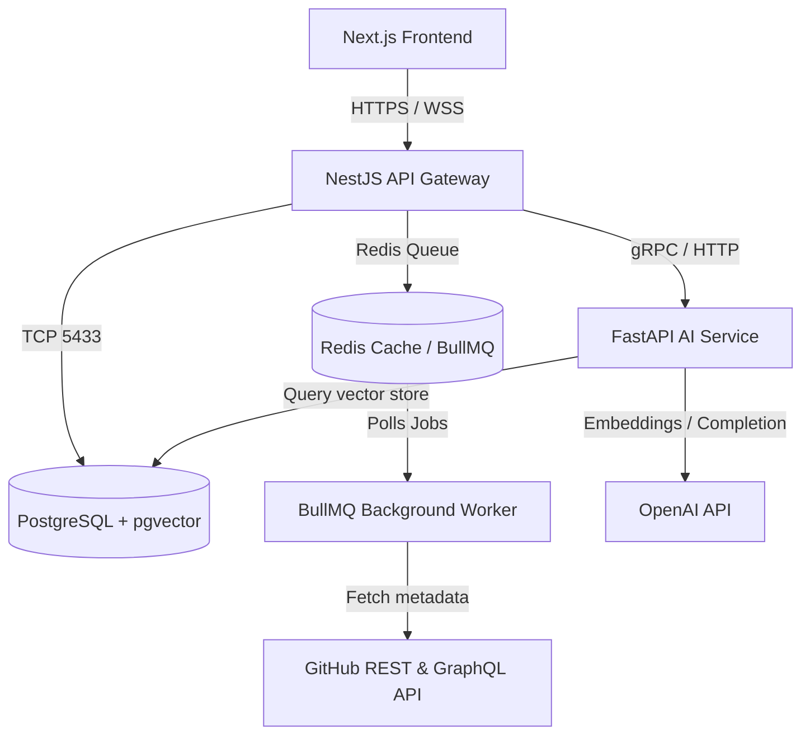
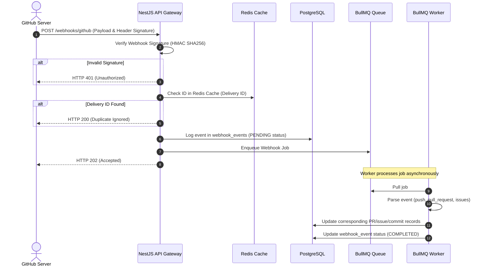
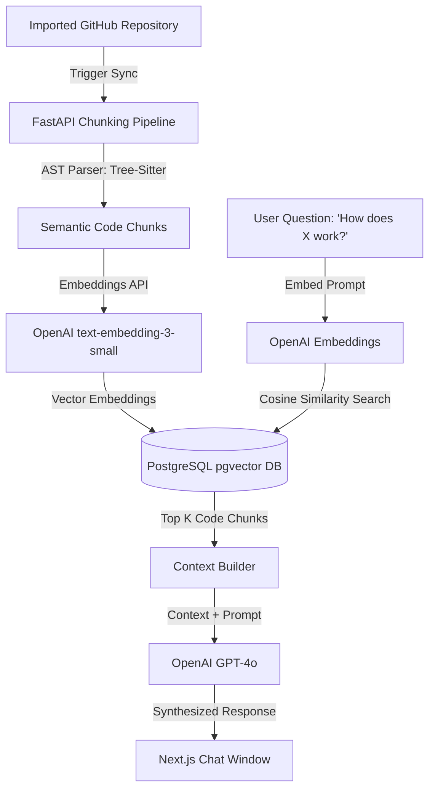

# DevOS — High-Level System Design (HLD)

This document outlines the architectural blueprints, communication flows, and system patterns of the DevOS platform.

---

## 1. System Architecture Diagram



---

## 2. Microservice Communications

| Channel | Source | Destination | Protocol | Purpose |
| :--- | :--- | :--- | :--- | :--- |
| **User API Actions** | Next.js Frontend | NestJS API Gateway | HTTP / REST | Fetching dashboard data, managing orgs, updating sprints. |
| **Realtime Updates** | NestJS API Gateway | Next.js Frontend | WebSockets (WSS) | Realtime webhook execution events and notification alerts. |
| **AI Inference** | NestJS API Gateway | FastAPI Service | HTTP / JSON | Executing codebase RAG queries and pull request code reviews. |
| **Background Jobs** | NestJS API Gateway | Redis / BullMQ | BullMQ Protocol | Enqueuing heavy operations (initial syncs, webhook processes). |
| **Vector DB Queries** | FastAPI Service | PostgreSQL DB | SQL (pgvector) | Semantic retrieval of code blocks for RAG synthesis. |

---

## 3. GitHub Webhook Processing & Idempotency Pipeline

To prevent race conditions, duplicate operations, and rate limits, DevOS handles webhook events using an event-driven queue:



---

## 4. AI Repository Chat (RAG) Architecture

The FastAPI AI service builds and queries a code-level knowledge base using `pgvector`:



### Chunking Strategy
Code files are chunked semantically using AST parsing (`tree-sitter`) rather than arbitrary character splits. This keeps functions and classes intact, preserving context.

### Indexing Strategy
Vector columns are indexed using HNSW (Hierarchical Navigable Small World) indices on PostgreSQL:
```sql
CREATE INDEX ON "AiDocument" USING hnsw (embedding vector_cosine_ops);
```
HNSW yields fast, sub-millisecond retrieval rates for semantic searches.
