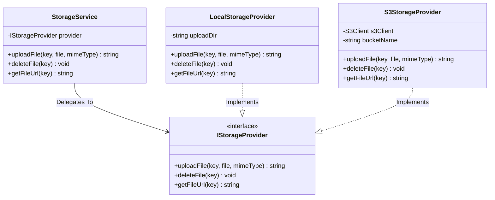
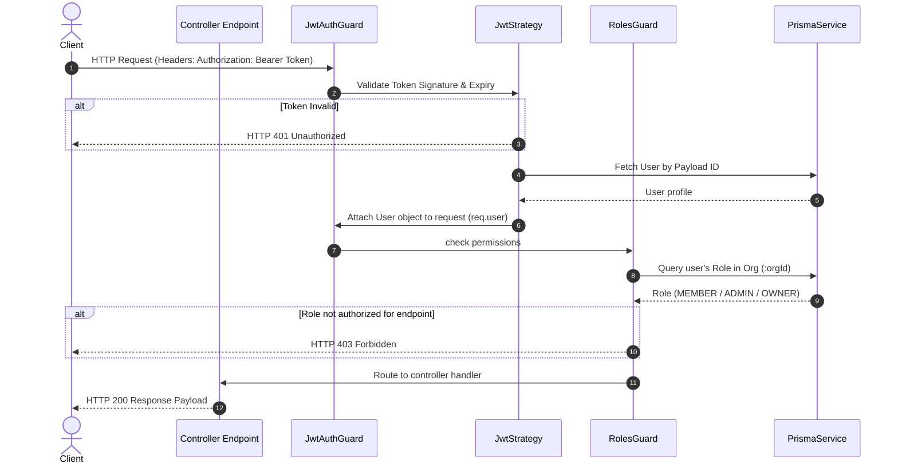

# DevOS — Low-Level Design (LLD)

This document details the software design patterns, class relationships, worker details, and codebase directories.

---

## 1. Core Software Design Patterns

### Storage Strategy Pattern
Enables the application to switch file upload strategies at runtime without changing the consuming controller code.



---

## 2. Authentication & Authorization Security Flow

Endpoints are protected by sequential passport and custom interceptors:



---

## 3. Background Workers (BullMQ / Redis)
Heavy GitHub interactions and AI review jobs are processed in separate queues using BullMQ:

| Queue Name | Job Name | Payload Type | Description |
| :--- | :--- | :--- | :--- |
| **`github-sync`** | `repo-import` | `{ repoId: string, orgId: string }` | Triggers the initial REST sync of commits, PRs, and issues. |
| **`github-sync`** | `incremental-sync` | `{ orgId: string }` | Nightly cron task executing incremental delta-checkups. |
| **`webhook-process`** | `process-event` | `{ deliveryId: string, event: string, payload: any }` | Asynchronously processes webhook event payloads. |
| **`ai-review`** | `pr-review` | `{ prId: string, diffUrl: string }` | Sends pull request diffs to FastAPI, processes evaluations, updates DB. |

### Retry Logic configuration
```typescript
const jobOptions = {
  attempts: 3, // Retry failed jobs up to 3 times
  backoff: {
    type: 'exponential',
    delay: 5000, // Wait 5s, then 10s, then 20s
  },
  removeOnComplete: true, // Auto clean up success logs
  removeOnFail: false, // Keep failure stacks for analysis
};
```

---

## 4. Codebase Directory Structures

### NestJS Backend Structure (`/backend/`)
```
src/
 ├── main.ts                     # App bootstrap
 ├── app.module.ts               # Main imports
 ├── app.controller.ts           # Root routers
 ├── prisma/                     # Database client wrapper
 │    ├── prisma.service.ts
 │    └── prisma.module.ts
 ├── config/                     # Env validator
 │    └── env.validation.ts
 ├── storage/                    # Storage Strategy pattern
 │    ├── storage.interface.ts
 │    ├── local-storage.provider.ts
 │    ├── s3-storage.provider.ts
 │    ├── storage.service.ts
 │    └── storage.module.ts
 ├── auth/                       # Login & token validations
 │    ├── dto/
 │    ├── guards/
 │    ├── strategies/
 │    ├── auth.service.ts
 │    └── auth.controller.ts
 └── orgs/                       # Workspaces & RBAC memberships
      ├── dto/
      ├── guards/
      └── orgs.controller.ts
```

### FastAPI AI Service Structure (`/ai-service/`)
```
ai-service/
 ├── main.py                     # App entry point
 ├── requirements.txt            # Package manifests
 ├── app/
      ├── config.py              # Settings loader
      ├── routers/               # Routes (chat, review)
      ├── schemas/               # Request/response validation
      ├── services/              # Vector search, OpenAI integrations
      └── agents/                # LangGraph workflows
```
