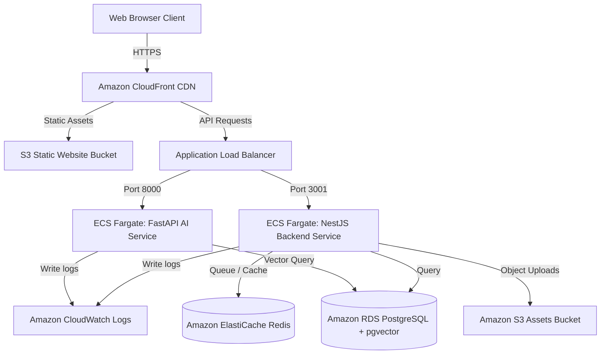

# DevOS — AWS Infrastructure Guide

This document defines the configuration, network policies, IAM rules, and architecture specs for AWS.

---

## 1. System Infrastructure Mapping



---

## 2. Service Specifications

### A. AWS S3 (Assets Storage)
- **Bucket Policy**: Restricts anonymous reads unless requests match a signed URL hash.
- **CORS Rule Config**:
  ```json
  [
    {
      "AllowedHeaders": ["*"],
      "AllowedMethods": ["GET", "PUT", "POST", "DELETE"],
      "AllowedOrigins": ["https://devos.io", "http://localhost:3000"],
      "ExposeHeaders": ["ETag"],
      "MaxAgeSeconds": 3000
    }
  ]
  ```

### B. Amazon RDS PostgreSQL
- **Engine**: PostgreSQL v16.x or newer.
- **Instance Sizing**: `db.t4g.medium` (Minimum 2 vCPUs, 4GB RAM to handle vector math).
- **Extension Script**:
  ```sql
  CREATE EXTENSION IF NOT EXISTS "uuid-ossp";
  CREATE EXTENSION IF NOT EXISTS "vector";
  ```

### C. Amazon ECS Fargate
- **Cluster**: `devos-prod-cluster`
- **Task Allocations**:
  - **NestJS Service Task**: 0.5 vCPU / 1GB RAM. Scaled dynamically between 2 and 5 tasks.
  - **FastAPI AI Task**: 1.0 vCPU / 2GB RAM. Scaled dynamically between 2 and 4 tasks.

---

## 3. Core IAM Policies

### A. S3 Service Access Policy (Used by NestJS API)
```json
{
  "Version": "2012-10-17",
  "Statement": [
    {
      "Sid": "S3BucketAccess",
      "Effect": "Allow",
      "Action": [
        "s3:PutObject",
        "s3:GetObject",
        "s3:DeleteObject",
        "s3:PutObjectAcl"
      ],
      "Resource": "arn:aws:s3:::devos-assets-bucket/*"
    }
  ]
}
```

### B. Secrets Manager Read Policy
```json
{
  "Version": "2012-10-17",
  "Statement": [
    {
      "Sid": "ReadSecrets",
      "Effect": "Allow",
      "Action": [
        "secretsmanager:GetSecretValue"
      ],
      "Resource": "arn:aws:secretsmanager:us-east-1:123456789012:secret:devos-prod-secrets-*"
    }
  ]
}
```
